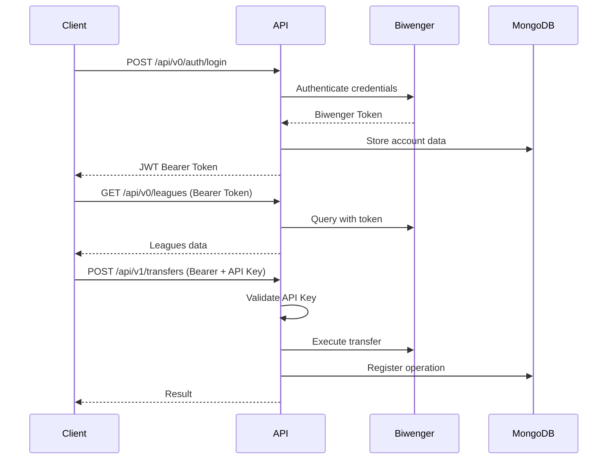

# API Usage Guide - BiwengerProManagerAPI

## 🎯 Introduction

BiwengerProManagerAPI provides a REST interface to interact with Biwenger data and functionalities. The API is organized into two versions:

- **V0 (Public Endpoints)**: Read operations and basic authentication (no API key required)
- **V1 (Premium Endpoints)**: Data modification operations that require API Key authentication

## 🔐 Authentication and Authorization

### Dual Authentication System

The API uses a two-level authentication system:

#### 1. Bearer Token (JWT)
- **Purpose**: Identify the authenticated user session with Biwenger
- **Acquisition**: Via `/api/v0/auth/login` endpoint
- **Usage**: `Authorization: Bearer <token>` header
- **Scope**: Required for most endpoints to access user's leagues, players, etc.

#### 2. API Key (Premium Endpoints)
- **Purpose**: Authorize access to premium functionalities that modify data
- **Configuration**: Set in your environment `.env` file (`API_KEY=your-key`)
- **Usage**: `X-API-Key: <your-api-key>` header
- **Scope**: Only V1 endpoints (transfers, clauses, settings modifications)

### Authentication Flow



## 📚 V0 Endpoints - Public (No API Key Required)

### Authentication

#### POST `/api/v0/auth/login`
Authenticate user with Biwenger credentials and obtain a Bearer token.

**Request:**
```json
{
  "email": "your-email@biwenger.com",
  "password": "your-password"
}
```

**Response (200):**
```json
{
  "status": 200,
  "message": "Logged in",
  "data": {
    "token": "eyJ0eXAiOiJKV1QiLCJhbGciOiJIUzI1NiJ9...",
    "account": {
      "id": 12345678,
      "name": "Your Name",
      "email": "your-email@biwenger.com"
    }
  }
}
```

**Validation:**
- `email`: Must be valid email format
- `password`: Required, minimum 4 characters

**Errors:**
- `400`: Invalid payload or validation failed
- `401`: Invalid credentials

#### GET `/api/v0/account`
Get current user account information.

**Headers:**
```
Authorization: Bearer <token>
```

**Response (200):**
```json
{
  "status": 200,
  "message": "Account retrieved",
  "data": {
    "id": 12345678,
    "name": "Your Name",
    "email": "your-email@biwenger.com",
    "credits": 100,
    "status": "active"
  }
}
```

### Leagues

#### GET `/api/v0/leagues`
Get list of user's leagues.

**Headers:**
```
Authorization: Bearer <token>
```

**Response (200):**
```json
{
  "status": 200,
  "message": "Leagues retrieved",
  "data": [
    {
      "id": 1358641,
      "name": "Friends League",
      "competition": "LaLiga",
      "users": 12,
      "mode": "league"
    }
  ]
}
```

#### GET `/api/v0/leagues/{id}`
Get detailed information for a specific league.

**Headers:**
```
Authorization: Bearer <token>
```

**Path Parameters:**
- `id`: League ID (positive integer)

**Response (200):**
```json
{
  "status": 200,
  "message": "League retrieved",
  "data": {
    "id": 1358641,
    "name": "Friends League",
    "competition": "LaLiga",
    "users": 12,
    "mode": "league",
    "settings": {
      "clauses_value": 200,
      "times_can_clause": 1,
      "max_times_claused": 1,
      "max_players_same_team": 4
    }
  }
}
```

Note: the endpoint also accepts the alternative HTTP header `X-Competition` if you prefer to send the competition id in a header instead of a query parameter.
### Players

#### GET `/api/v0/players`
Get list of players from a specific competition.

Note: `competition` can also be provided via the `X-Competition` header.
**Query Parameters:**
- `competition` (required): Competition ID (e.g., "2" for LaLiga)

**Response (200):**
```json
{
  "status": 200,
  "message": "Players retrieved",
  "data": [
    {
      "id": 34147,
      "name": "Vinícius Jr.",
      "team": "Real Madrid",
      "position": "Forward",
      "value": 50000000,
      "points": 127,
      "status": "ok"
    }
  ]
}
```

**Validation:**
- `competition`: Required, max 64 characters

#### GET `/api/v0/players/{id}`
Get detailed information for a specific player.
**Path Parameters:**
- `id`: Player ID (positive integer)

**Query Parameters:**
- `competition` (required): Competition ID

**Response (200):**
```json
{
  "status": 200,
  "message": "Player retrieved",
  "data": {
    "id": 34147,
    "name": "Vinícius Jr.",
    "team": "Real Madrid",
    "position": "Forward",
    "value": 50000000,
    "points": 127,
    "status": "ok",
    "fitness": 100,
    "owner": null
  }
}
```

### Users

#### GET `/api/v0/users`
Get list of users from a league with their standings.

**Headers:**
```
Authorization: Bearer <token>
```

**Query Parameters:**
- `league` (required): League ID

**Response (200):**
```json
{
  "status": 200,
  "message": "Users retrieved",
  "data": [
    {
      "id": 123456,
      "name": "Manager 1",
      "points": 850,
      "position": 1,
      "lastPositions": [1, 2, 1, 1],
      "teamName": "My Team",
      "teamBadge": "https://...",
      "role": "participant"
    }
  ]
}
```

#### GET `/api/v0/users/{id}`
Get detailed information for a specific user.

**Headers:**
```
Authorization: Bearer <token>
```

**Path Parameters:**
- `id`: User ID (positive integer)

**Query Parameters:**
- `league` (required): League ID

**Response (200):**
```json
{
  "status": 200,
  "message": "User retrieved",
  "data": {
    "id": 123456,
    "name": "Manager 1",
    "points": 850,
    "position": 1,
    "teamName": "My Team",
    "players": [...],
    "playersPerTeam": {
      "Real Madrid": 3,
      "Barcelona": 2
    }
  }
}
```

#### GET `/api/v0/users/{id}/players`
Get players owned by a specific user.

**Headers:**
```
Authorization: Bearer <token>
```

**Path Parameters:**
- `id`: User ID (positive integer)

**Query Parameters:**
- `league` (optional): League ID

**Response (200):**
```json
{
  "status": 200,
  "message": "User players retrieved",
  "data": [
    {
      "id": 34147,
      "name": "Vinícius Jr.",
      "team": "Real Madrid",
      "position": "Forward",
      "value": 50000000,
      "points": 127
    }
  ]
}
```

#### POST `/api/v0/users/sync`
Synchronize users from Biwenger API to database.

**Headers:**
```
Authorization: Bearer <token>
```

**Query Parameters:**
- `league` (required): League ID

**Response (200):**
```json
{
  "status": 200,
  "message": "Users synchronized successfully"
}
```

### Rounds

#### GET `/api/v0/rounds`
Get list of rounds/matchdays.

**Response (200):**
```json
{
  "status": 200,
  "message": "Rounds retrieved",
  "data": [
    {
      "id": 1,
      "name": "Matchday 1",
      "start_date": "2024-08-15",
      "end_date": "2024-08-18",
      "locked": false
    }
  ]
}
```

#### GET `/api/v0/rounds/results`
Get round results.

**Headers (optional):**
```
Authorization: Bearer <token>
```

**Query Parameters:**
- `league` (optional): League ID

**Response (200):**
```json
{
  "status": 200,
  "message": "Rounds results retrieved",
  "data": [
    {
      "round": 1,
      "user_results": [
        {
          "_id": 123456,
          "points": 85,
          "players_used": 11
        }
      ]
    }
  ]
}
```

## 🔑 V1 Endpoints - Premium (Require API Key)

### Authentication Headers

All V1 endpoints require both Bearer token and API key:

```
Authorization: Bearer <token>
X-API-Key: <your-api-key>
Content-Type: application/json
```

Optional context headers:
```
X-League: <league-id>    # League context
X-User: <user-id>        # User context
```

### Transfers

#### POST `/api/v1/transfers`
Execute a player transfer between users.

**Request:**
```json
{
  "playerId": 34147,
  "fromUserId": 123456,
  "toUserId": 789012,
  "price": 25000000,
  "leagueId": "1358641"
}
```

**Headers:**
```
Authorization: Bearer <token>
X-API-Key: <your-api-key>
X-League: 1358641
X-User: 123456
Content-Type: application/json
```

**Response (200):**
```json
{
  "status": 200,
  "message": "Transfer executed",
  "data": {
    "message": "Transfer completed successfully"
  }
}
```

**Validation Rules:**
- `playerId`: Must be positive integer
- `fromUserId` and `toUserId`: Must be different positive integers
- `price`: Must be non-negative numeric value (optional)
- `leagueId`: Required string

**Errors:**
- `400`: Invalid payload or validation failed
- `401`: Missing or invalid Bearer token or API key
- `500`: Transfer execution failed

### Clauses

#### POST `/api/v1/clauses`
Execute a buyout clause (cláusula de rescate).

**Request:**
```json
{
  "playerId": 34147,
  "clauseType": "buyout",
  "amount": 50000000,
  "leagueId": "1358641",
  "fromUserId": 123456
}
```

**Headers:**
```
Authorization: Bearer <token>
X-API-Key: <your-api-key>
X-League: 1358641
X-User: 123456
Content-Type: application/json
```

**Response (200):**
```json
{
  "status": 200,
  "message": "Clause processed",
  "data": {
    "result": {
      "success": true,
      "player": "Vinícius Jr.",
      "amount": 50000000,
      "timestamp": "2024-12-11T10:30:00Z"
    },
    "settings": {
      "clauses_value": 200,
      "times_can_clause": 1,
      "max_times_claused": 1
    }
  }
}
```

**Validation Rules:**
- `playerId`: Must be positive integer
- `clauseType`: Must be non-empty string
- `amount`: Must be non-negative numeric value
- Required fields: `playerId`, `clauseType`, `amount`

**Supported Clause Types:**
- `buyout`: Standard buyout clause
- `release`: Player release

### League Settings

#### GET `/api/v1/leagues/{id}/settings`
Get current league configuration.

**Headers:**
```
Authorization: Bearer <token>
X-API-Key: <your-api-key>
```

**Path Parameters:**
- `id`: League ID (positive integer)

**Response (200):**
```json
{
  "status": 200,
  "message": "Settings retrieved",
  "data": {
    "id": 1358641,
    "clauses_value": 200,
    "times_can_clause": 1,
    "max_times_claused": 1,
    "num_rounds_to_unlock": 2,
    "num_days_before_round": 2,
    "max_players_same_team": 4
  }
}
```

#### POST/PUT `/api/v1/leagues/{id}/settings`
Update league configuration (partial updates supported).

**Headers:**
```
Authorization: Bearer <token>
X-API-Key: <your-api-key>
Content-Type: application/json
```

**Path Parameters:**
- `id`: League ID (positive integer)

**Request (partial update example):**
```json
{
  "clauses_value": 250,
  "max_players_same_team": 5,
  "times_can_clause": 2
}
```

**Response (200):**
```json
{
  "status": 200,
  "message": "Settings updated",
  "data": null
}
```

**Configurable Fields:**
- `clauses_value`: Clause value amount (non-negative integer)
- `times_can_clause`: Times a user can clause per week (non-negative integer)
- `max_times_claused`: Maximum times a user can be claused (non-negative integer)
- `num_rounds_to_unlock`: Rounds needed to unlock (non-negative integer)
- `num_days_before_round`: Days before round to lock (non-negative integer)
- `max_players_same_team`: Maximum players from same team (non-negative integer)

**Validation:**
- All settings must be non-negative integers
- Unknown fields are ignored
- At least one valid field must be provided

## 🔍 HTTP Response Codes

### Success (2xx)
- **200 OK**: Operation successful
- **201 Created**: Resource created successfully

### Client Errors (4xx)
- **400 Bad Request**: Invalid payload, missing parameters, or validation failed
- **401 Unauthorized**: Missing/invalid Bearer token or API key
- **403 Forbidden**: Valid credentials but insufficient permissions
- **404 Not Found**: Resource not found
- **422 Unprocessable Entity**: Data validation failed

### Server Errors (5xx)
- **500 Internal Server Error**: Internal server error
- **503 Service Unavailable**: Service temporarily unavailable (e.g., MongoDB timeout)

## 📝 Response Format

### Standard Structure

All responses follow this consistent format:

```json
{
  "status": 200,
  "message": "Operation successful",
  "data": { /* endpoint-specific content */ }
}
```

### Error Responses

```json
{
  "status": 400,
  "message": "Validation failed",
  "data": {
    "errors": [
      {
        "field": "playerId",
        "message": "playerId must be positive integer"
      }
    ]
  }
}
```

## 🚀 Usage Examples

### Example 1: Complete Authentication Flow

```bash
# 1. Login to get Bearer token
curl -X POST "http://localhost:8080/api/v0/auth/login" \
  -H "Content-Type: application/json" \
  -d '{"email":"your-email@example.com","password":"your-password"}'

# 2. Save token from response
TOKEN="eyJ0eXAiOiJKV1QiLCJhbGciOiJIUzI1NiJ9..."

# 3. Get user's leagues
curl -X GET "http://localhost:8080/api/v0/leagues" \
  -H "Authorization: Bearer $TOKEN"
```

### Example 2: Premium Transfer Operation

```bash
# Execute transfer with API Key
curl -X POST "http://localhost:8080/api/v1/transfers" \
  -H "Authorization: Bearer $TOKEN" \
  -H "X-API-Key: your-api-key" \
  -H "X-League: 1358641" \
  -H "X-User: 123456" \
  -H "Content-Type: application/json" \
  -d '{
    "playerId": 34147,
    "fromUserId": 123456,
    "toUserId": 789012,
    "price": 25000000,
    "leagueId": "1358641"
  }'
```

### Example 3: League Settings Management

```bash
# Get current settings
curl -X GET "http://localhost:8080/api/v1/leagues/1358641/settings" \
  -H "Authorization: Bearer $TOKEN" \
  -H "X-API-Key: your-api-key"

# Update settings (partial)
curl -X PUT "http://localhost:8080/api/v1/leagues/1358641/settings" \
  -H "Authorization: Bearer $TOKEN" \
  -H "X-API-Key: your-api-key" \
  -H "Content-Type: application/json" \
  -d '{
    "clauses_value": 300,
    "max_players_same_team": 5
  }'
```

### Example 4: Player and User Data

```bash
# Get players from LaLiga (competition ID 2)
curl -X GET "http://localhost:8080/api/v0/players?competition=2"

# Get specific player details
curl -X GET "http://localhost:8080/api/v0/players/34147?competition=2"

# Get users from a league
curl -X GET "http://localhost:8080/api/v0/users?league=1358641" \
  -H "Authorization: Bearer $TOKEN"

# Get specific user's players
curl -X GET "http://localhost:8080/api/v0/users/123456/players?league=1358641" \
  -H "Authorization: Bearer $TOKEN"
```

## 🔧 Best Practices

### Authentication
1. **Secure token storage** in client applications
2. **Implement token refresh** for long sessions
3. **Never expose API Keys** in client-side code
4. **Use HTTPS** in production environments

### Error Handling
1. **Always validate responses** before processing data
2. **Implement retry logic** for temporary errors (5xx)
3. **Handle rate limiting** gracefully (if implemented)
4. **Log detailed errors** for debugging

### Performance
1. **Cache static data** (players, leagues) when possible
2. **Use query parameters** to filter results
3. **Implement pagination** for large datasets
4. **Compress requests/responses** when supported

### Security
1. **Validate all inputs** on the client side
2. **Don't rely solely on frontend validation**
3. **Set appropriate timeouts** for requests
4. **Sanitize data** before displaying to users

## 📱 Integration Examples

### JavaScript/TypeScript (Frontend)

```javascript
class BiwengerAPIClient {
  constructor(baseURL, apiKey) {
    this.baseURL = baseURL;
    this.apiKey = apiKey;
    this.token = null;
  }

  async login(email, password) {
    const response = await fetch(`${this.baseURL}/api/v0/auth/login`, {
      method: 'POST',
      headers: { 'Content-Type': 'application/json' },
      body: JSON.stringify({ email, password })
    });
    
    const data = await response.json();
    if (data.status === 200) {
      this.token = data.data.token;
    }
    return data;
  }

  async getLeagues() {
    return this.makeRequest('GET', '/api/v0/leagues');
  }

  async executeTransfer(transferData) {
    return this.makeRequest('POST', '/api/v1/transfers', transferData, true);
  }

  async makeRequest(method, endpoint, body = null, premium = false) {
    const headers = {
      'Content-Type': 'application/json',
      'Authorization': `Bearer ${this.token}`
    };

    if (premium) {
      headers['X-API-Key'] = this.apiKey;
    }

    const config = {
      method,
      headers,
      body: body ? JSON.stringify(body) : null
    };

    const response = await fetch(`${this.baseURL}${endpoint}`, config);
    return response.json();
  }
}

// Usage example
const client = new BiwengerAPIClient('http://localhost:8080', 'your-api-key');
await client.login('user@example.com', 'password');
const leagues = await client.getLeagues();
```

### PHP (Backend)

```php
class BiwengerAPIClient {
    private $baseURL;
    private $apiKey;
    private $token;

    public function __construct($baseURL, $apiKey) {
        $this->baseURL = $baseURL;
        $this->apiKey = $apiKey;
    }

    public function login($email, $password) {
        $data = ['email' => $email, 'password' => $password];
        $response = $this->makeRequest('POST', '/api/v0/auth/login', $data);
        
        if ($response['status'] === 200) {
            $this->token = $response['data']['token'];
        }
        
        return $response;
    }

    public function getLeagues() {
        return $this->makeRequest('GET', '/api/v0/leagues');
    }

    public function executeTransfer($transferData) {
        return $this->makeRequest('POST', '/api/v1/transfers', $transferData, true);
    }

    private function makeRequest($method, $endpoint, $data = null, $premium = false) {
        $headers = [
            'Content-Type: application/json',
            'Authorization: Bearer ' . $this->token
        ];

        if ($premium) {
            $headers[] = 'X-API-Key: ' . $this->apiKey;
        }

        $ch = curl_init();
        curl_setopt_array($ch, [
            CURLOPT_URL => $this->baseURL . $endpoint,
            CURLOPT_CUSTOMREQUEST => $method,
            CURLOPT_HTTPHEADER => $headers,
            CURLOPT_RETURNTRANSFER => true,
            CURLOPT_POSTFIELDS => $data ? json_encode($data) : null
        ]);

        $response = curl_exec($ch);
        $httpCode = curl_getinfo($ch, CURLINFO_HTTP_CODE);
        curl_close($ch);

        return json_decode($response, true);
    }
}

// Usage example
$client = new BiwengerAPIClient('http://localhost:8080', 'your-api-key');
$loginResult = $client->login('user@example.com', 'password');
if ($loginResult['status'] === 200) {
    $leagues = $client->getLeagues();
}
```

## 🔗 Related Links

- **[Installation Guide](01-installation-guide.md)**: Project setup and configuration
- **[Data Model](03-data-model.md)**: Database structure and models
- **[Testing Tools](04-testing-tools.md)**: Postman collections and testing
- **[GitHub Repository](https://github.com/Joselu2099/BiwengerProManagerAPI)**: Source code

This guide provides everything you need to integrate and use the BiwengerProManagerAPI in your applications!