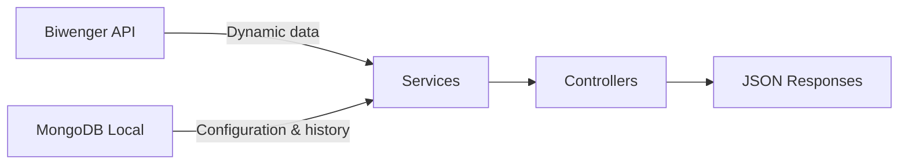
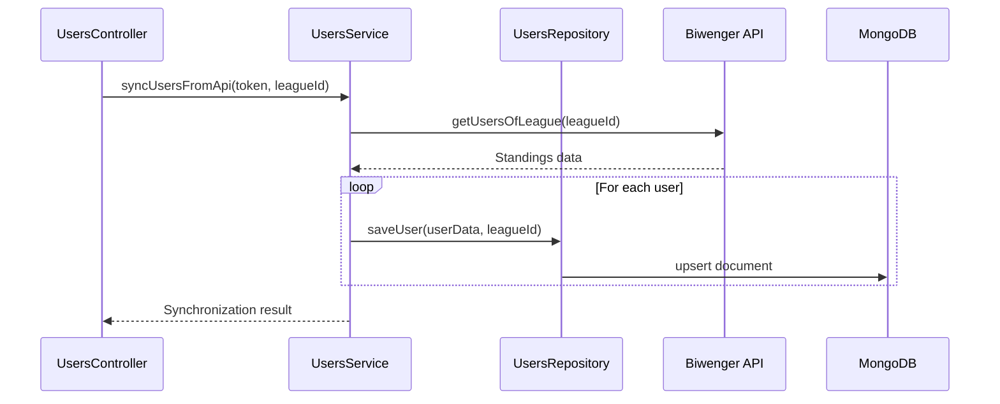
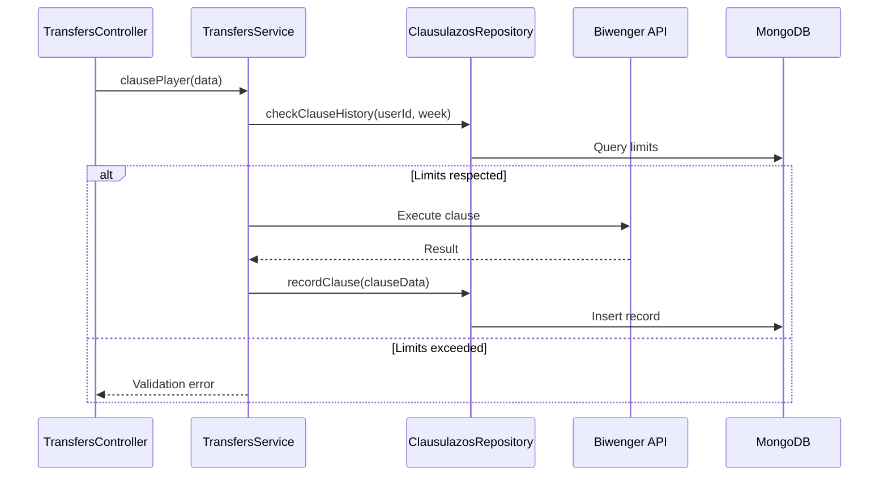

# Data Model Guide - BiwengerProManagerAPI

## 🗄️ Introduction

BiwengerProManagerAPI uses a hybrid data persistence architecture where MongoDB serves as the primary database for local data storage, while the Biwenger API acts as the source of truth for dynamic data (players, standings, etc.).

## 🏗️ Data Architecture

### Data Sources



**Biwenger API (External source):**
- Real-time player data
- League standings
- User information
- Rounds and results

**MongoDB Local (Persistence):**
- League configurations and settings
- Clause execution history
- User account data
- Frequently accessed data cache

## 📊 MongoDB Collections

### Database Structure

```
biwenger (database)
├── users             # Users with league standings data
├── leagues           # Basic league information
├── settings          # League configurations (separate collection)
├── clausulazos       # Clause execution history
└── accounts          # User account data
```

### 1. Collection `users`

Stores league users with their standings and statistics data.

**Document structure:**
```json
{
  "_id": ObjectId("..."),
    "_id": "123456",
  "league_id": 1358641,
  "account_id": 3489720,
  "id": 123456,
  "name": "Premium Manager",
  "icon": "https://biwenger.as.com/avatars/123.png",
  "points": 850,
  "lastPositions": [1, 2, 1, 1, 3],
  "position": 1,
  "positionInc": -1,
  "role": "participant",
  "balance": 75000000,
  "teamValue": 500000000,
  "players": [],
  "playersPerTeam": {
    "1": 3,
    "2": 2,
    "3": 1
  },
  "nmClausesDone": 2,
  "timesBeenClaused": 1,
  "created_at": ISODate("2024-12-11T10:00:00Z"),
  "updated_at": ISODate("2024-12-11T10:00:00Z")
}
```

**Indexes:**
```javascript
db.users.createIndex({ "league_id": 1 })
// Note: user id is stored as the MongoDB document `_id` field. Avoid duplicating
// it into a separate `user_id` field. Create an index on `league_id` instead.
db.users.createIndex({ "league_id": 1 })
```

**Key fields:**
- `_id`: User ID from Biwenger (string) — stored as the document `_id` field
- `league_id`: League ID (string)
- `points`: Accumulated points
- `position`: Current standing position
- `lastPositions`: Position history (last 5)
- `playersPerTeam`: Players count by team ID
- `nmClausesDone`: Number of clauses executed this week
- `timesBeenClaused`: Times this user has been claused

### 2. Collection `leagues`

Stores basic league information (settings are in separate collection).

**Document structure:**
```json
{
  "_id": 1358641,
  "name": "Friends League",
  "competition": "LaLiga",
  "scoreID": 2,
  "type": "private",
  "mode": "league",
  "marketMode": "continuous",
  "created": 1609459200,
  "icon": "https://biwenger.as.com/leagues/icons/123.png",
  "cover": "https://biwenger.as.com/leagues/covers/123.png",
  "upgrades": null,
  "created_at": ISODate("2024-12-01T00:00:00Z"),
  "updated_at": ISODate("2024-12-11T10:00:00Z")
}
```

**Indexes:**
```javascript
db.leagues.createIndex({ "_id": 1 })
```

**Key fields:**
- `_id`: League ID (integer)
- `name`: League name
- `competition`: Competition name (LaLiga, Premier League, etc.)
- `scoreID`: Competition identifier
- `mode`: League mode (league, cup, etc.)
- `marketMode`: Market type (continuous, daily, etc.)

### 3. Collection `settings` (separate from leagues)

Stores custom league configurations managed by the API.

**Document structure:**
```json
{
  "_id": 1358641,
  "biwenger_settings": {
    "secret": true,
    "privacy": "private",
    "clause": 1,
    "clauseIncrement": 0,
    "balance": 100000000,
    "maxPurchasePrice": null,
    "lineupMaxClubPlayers": 4,
    "auctions": false
  },
  "custom_settings": {
    "clauses": true,
    "clauses_value": 200,
    "times_can_clause": 1,
    "max_times_claused": 1,
    "num_rounds_to_unlock": 2,
    "num_days_before_round": 2,
    "max_players_same_team": 4
  },
  "created_at": ISODate("2024-12-01T00:00:00Z"),
  "updated_at": ISODate("2024-12-11T10:00:00Z")
}
```

**Indexes:**
```javascript
db.settings.createIndex({ "_id": 1 })
```

**Custom settings available:**
- `clauses`: Enable custom clause system
- `clauses_value`: Clause value in millions
- `times_can_clause`: Times a user can clause per week
- `max_times_claused`: Maximum times a user can be claused
- `num_rounds_to_unlock`: Rounds needed to unlock
- `num_days_before_round`: Days before round to lock
- `max_players_same_team`: Maximum players from same team

### 4. Collection `clausulazos`

Complete history of executed clauses.

**Document structure:**
```json
{
  "_id": ObjectId("..."),
  "user_from_id": 123456,
  "user_from": "Manager 1",
  "user_to_id": 789012,
  "user_to": "Manager 2",
  "player_id": 34147,
  "player": "Vinícius Jr.",
  "amount": 50000000,
  "date": ISODate("2024-12-11T10:30:00Z"),
  "week": 202450
}
```

**Indexes:**
```javascript
db.clausulazos.createIndex({ "user_to_id": 1, "week": 1 })
db.clausulazos.createIndex({ "user_from_id": 1, "week": 1 })
db.clausulazos.createIndex({ "player_id": 1, "date": 1 })
```

**Key fields:**
- `week`: Week key calculated as YYYYWW (integer)
- `amount`: Amount paid for the clause
- `date`: Execution timestamp
- `player_id`: ID of the claused player

### 5. Collection `accounts`

User account information retrieved from Biwenger.

**Document structure:**
```json
{
  "_id": ObjectId("..."),
  "id": 12345678,
  "name": "John Doe",
  "email": "john@example.com",
  "phone": "+34123456789",
  "locale": "es",
  "birthday": 19900515,
  "status": "active",
  "credits": 100,
  "created": 1609459200,
  "newsletter": true,
  "unreadMessages": false,
  "lastAccess": 1702905600,
  "source": null,
  "devices": [
    {
      "type": "android",
      "token": "firebase_token_...",
      "updated": 1702905600
    }
  ]
}
```

**Indexes:**
```javascript
db.accounts.createIndex({ "id": 1 }, { unique: true })
db.accounts.createIndex({ "email": 1 })
```

## 🎯 PHP Data Models

### User Class

```php
namespace BiwengerProManagerAPI\Models;

class User implements \JsonSerializable
{
    private $id;                    // User ID
    private $name;                  // User name
    private $icon;                  // Avatar URL
    private $points;                // Current points
    private $lastPositions;         // Position history array
    private $position;              // Current position
    private $positionInc;           // Position change
    private $role;                  // User role in league
    
    // Legacy properties for backward compatibility
    private $balance;               // User balance
    private $teamValue;             // Total team value
    private $players = [];          // Player[] array
    private $playersPerTeam = [];   // Team distribution
    private $nmClausesDone = 0;     // Clauses executed this week
    private $timesBeenClaused = 0;  // Times claused by others

    public function canClausule(int $timesCanClause, int $maxTimesBeenClaused): bool
    {
        if ($this->nmClausesDone < $timesCanClause) return true;
        return $this->nmClausesDone < $this->timesBeenClaused && 
               $this->timesBeenClaused < $maxTimesBeenClaused;
    }

    public function exceedsPlayersLimit(int $maxPlayersSameTeam): bool
    {
        foreach ($this->playersPerTeam as $amount) {
            if ($amount > $maxPlayersSameTeam) return true;
        }
        return false;
    }

    public function hasPlayer($playerId): bool
    {
        foreach ($this->players as $p) {
            if ($p instanceof Player) {
                $playerData = $p->jsonSerialize();
                if ((string)$playerData['id'] === (string)$playerId) {
                    return true;
                }
            }
        }
        return false;
    }
}
```

### League Class

```php
namespace BiwengerProManagerAPI\Models;

class League implements \JsonSerializable
{
    private $id;            // League ID
    private $name;          // League name
    private $competition;   // Competition name
    private $scoreID;       // Competition ID
    private $type;          // League type (private/public)
    private $mode;          // League mode
    private $marketMode;    // Market mode
    private $created;       // Creation timestamp
    private $icon;          // League icon URL
    private $cover;         // League cover URL
    private $settings;      // Setting object
    private $upgrades;      // League upgrades

    public function __construct(array $data, Setting $settings = null)
    {
        $this->id = $data['id'] ?? null;
        $this->name = $data['name'] ?? null;
        $this->competition = $data['competition'] ?? null;
        // ... map other fields
        $this->settings = $settings; // Setting object instead of raw array
    }
}
```

### Setting Class

```php
namespace BiwengerProManagerAPI\Models;

class Setting implements \JsonSerializable
{
    // Biwenger settings from API
    private $secret;                // League privacy
    private $privacy;               // Privacy level
    private $clause;                // Clause enable flag
    private $clauseIncrement;       // Clause increment
    private $balance;               // Starting balance
    private $lineupMaxClubPlayers;  // Max players per team
    // ... other Biwenger settings

    // Custom settings from our database
    private $clauses;               // Custom clause system
    private $clauses_value;         // Clause value
    private $times_can_clause;      // Times can clause per week
    private $max_times_claused;     // Max times being claused
    private $num_rounds_to_unlock;  // Rounds to unlock
    private $num_days_before_round; // Days before round
    private $max_players_same_team; // Max players same team

    public function __construct(array $biwengerSettings = [], array $customSettings = [])
    {
        // Map Biwenger settings
        $this->secret = $biwengerSettings['secret'] ?? null;
        $this->clause = $biwengerSettings['clause'] ?? null;
        // ... map other Biwenger settings

        // Map custom settings
        $this->clauses = $customSettings['clauses'] ?? false;
        $this->clauses_value = $customSettings['clauses_value'] ?? 0;
        // ... map other custom settings
    }
}
```

### Player Class
Note: JSON serialization uses camelCase field names (for example, `teamID`).

```php
namespace BiwengerProManagerAPI\Models;

class Player implements \JsonSerializable
{
    private $id;              // Player ID
    private $name;            // Player name
    private $teamID;          // Team ID
    private $position;        // Player position
    private $price;           // Current price
    private $priceIncrement;  // Price change
    private $points;          // Current points

    public function jsonSerialize(): mixed
    {
        return [
            'id' => $this->id,
            'name' => $this->name,
            'teamID' => $this->teamID,
            'position' => $this->position,
            'price' => $this->price,
            'priceIncrement' => $this->priceIncrement,
            'points' => $this->points
        ];
    }
}
```

### Account Class

```php
namespace BiwengerProManagerAPI\Models;

class Account implements \JsonSerializable
{
    private $id;               // Account ID
    private $name;             // Full name
    private $email;            // Email address
    private $phone;            // Phone number
    private $locale;           // User locale
    private $birthday;         // Birthday (YYYYMMDD)
    private $status;           // Account status
    private $credits;          // Available credits
    private $created;          // Creation timestamp
    private $newsletter;       // Newsletter subscription
    private $unreadMessages;   // Unread messages flag
    private $lastAccess;       // Last access timestamp
    private $source;           // Registration source
    private $devices;          // Registered devices array

    public function __construct(array $data)
    {
        $this->id = $data['id'] ?? null;
        $this->name = $data['name'] ?? null;
        $this->email = $data['email'] ?? null;
        // ... map other fields from data array
        $this->devices = $data['devices'] ?? [];
    }
}
```

## 🔄 Data Flow and Repositories

### MongoDB Connection

```php
namespace BiwengerProManagerAPI\Database;

use MongoDB\Client;
use BiwengerProManagerAPI\Config\Config;

class MongoConnection
{
    private static $instance;
    private $client;
    private $db;

    private function __construct(string $uri = null, string $dbName = null)
    {
        // Use Config class to get MongoDB connection settings
        $cfgUri = Config::get('mongodb.uri');
        $cfgDb = Config::get('mongodb.db');

        $uri = $uri ?? $cfgUri ?? getenv('MONGODB_URI') ?: 'mongodb://127.0.0.1:27017';
        $dbName = $dbName ?? $cfgDb ?? getenv('MONGODB_DB') ?: 'biwenger';

        $this->client = new Client($uri);
        $this->db = $this->client->selectDatabase($dbName);
    }

    public static function getInstance(string $uri = null, string $dbName = null): self
    {
        if (self::$instance === null) {
            self::$instance = new self($uri, $dbName);
        }
        return self::$instance;
    }
}
```

### Users Repository

```php
namespace BiwengerProManagerAPI\Database;

class UsersRepository
{
    private $collection;

    public function __construct()
    {
        $mongoConnection = MongoConnection::getInstance();
        $this->collection = $mongoConnection->getDb()->selectCollection('users');
        
        // Create indexes for optimization
        $this->collection->createIndex(['league_id' => 1]);
    // previously created a composite index on league_id + user_id; we now
    // store the canonical user id as `_id` and avoid the extra field.
    $this->collection->createIndex(['league_id' => 1]);
    }

    public function saveUser(User $user, string $leagueId): bool
    {
        $filter = [
            // user id saved as the document _id; do not duplicate into user_id
            'league_id' => $leagueId
        ];

        $userData = (array) $user->jsonSerialize();
        $userData['league_id'] = $leagueId;
    // user id is persisted as _id above; no separate user_id field is written
        $userData['updated_at'] = new \MongoDB\BSON\UTCDateTime();

        $updateData = [
            '$set' => $userData,
            '$setOnInsert' => ['created_at' => new \MongoDB\BSON\UTCDateTime()]
        ];

        $result = $this->collection->updateOne($filter, $updateData, ['upsert' => true]);
        return $result->getUpsertedCount() > 0 || $result->getModifiedCount() > 0;
    }

    public function getUsersByLeague(string $leagueId): array
    {
        $filter = ['league_id' => $leagueId];
        $options = ['sort' => ['position' => 1]];

        $cursor = $this->collection->find($filter, $options);
        $users = [];

        foreach ($cursor as $document) {
            $userData = iterator_to_array($document);
            $user = $this->mapToUser($userData);
            if ($user) {
                $users[] = $user;
            }
        }

        return $users;
    }
}
```

### ClausulazosRepository

```php
namespace BiwengerProManagerAPI\Database;

class ClausulazosRepository
{
    private $db;
    private $collectionName = 'clausulazos';

    public function __construct($db = null)
    {
        $this->db = $db ?? MongoConnection::getInstance()->getDb();
        $col = $this->db->selectCollection($this->collectionName);
        
        // Create useful indexes
        $col->createIndex(['user_to_id' => 1, 'week' => 1]);
        $col->createIndex(['user_from_id' => 1, 'week' => 1]);
        $col->createIndex(['player_id' => 1, 'date' => 1]);
    }

    public function insertClausulazo($user_from_id, $user_from, $user_to_id, $user_to, 
                                   $player_id, $player, $amount, $date, $week): void
    {
        $col = $this->db->selectCollection($this->collectionName);
        $dt = new \DateTime($date);
        $utc = new \MongoDB\BSON\UTCDateTime($dt->getTimestamp() * 1000);
        
        $col->insertOne([
            'user_from_id' => (int)$user_from_id,
            'user_from' => $user_from,
            'user_to_id' => (int)$user_to_id,
            'user_to' => $user_to,
            'player_id' => (int)$player_id,
            'player' => $player,
            'amount' => (int)$amount,
            'date' => $utc,
            'week' => (int)$week,
        ]);
    }

    public function getNmClausesDone($userToId, $week): int
    {
        $col = $this->db->selectCollection($this->collectionName);
        return (int)$col->countDocuments([
            'user_to_id' => (int)$userToId, 
            'week' => (int)$week
        ]);
    }

    public function getNmTimesBeingClaused($userFromId, $week): int
    {
        $col = $this->db->selectCollection($this->collectionName);
        return (int)$col->countDocuments([
            'user_from_id' => (int)$userFromId, 
            'week' => (int)$week
        ]);
    }
}
```

### User Synchronization Flow



### Clause Execution Flow



## � Utility Classes

### Utils

```php
namespace BiwengerProManagerAPI\Utils;

class Utils
{
    /**
     * Return a week key integer for a given date (year * 100 + ISO week number).
     */
    public static function weekKey(string $date = 'now'): int
    {
        $dt = new \DateTime($date);
        $week = (int)$dt->format('W');
        $year = (int)$dt->format('o'); // ISO-8601 year
        return $year * 100 + $week;
    }
}
```

**Usage example:**
```php
$currentWeek = Utils::weekKey(); // 202450
$specificWeek = Utils::weekKey('2024-12-11'); // 202450
```

## 📈 Database Optimization

### Index Strategy

**Composite indexes for frequent queries:**
```javascript
// User queries by league
db.users.createIndex({ "league_id": 1, "position": 1 })

// Clause searches by week
db.clausulazos.createIndex({ "user_to_id": 1, "week": 1 })
db.clausulazos.createIndex({ "user_from_id": 1, "week": 1 })

// Settings lookup
db.settings.createIndex({ "_id": 1 })
```

### Common Aggregations

**Top 10 users by points:**
```javascript
db.users.aggregate([
  { $match: { "league_id": "1358641" } },
  { $sort: { "points": -1 } },
  { $limit: 10 },
  { $project: { 
    "name": 1, 
    "points": 1, 
    "position": 1 
  }}
])
```

**Clause statistics by league:**
```javascript
db.clausulazos.aggregate([
  { $match: { "week": 202450 } },
  { $group: {
    "_id": "$user_from_id",
    "totalClauses": { $sum: 1 },
    "totalAmount": { $sum: "$amount" },
    "avgAmount": { $avg: "$amount" }
  }},
  { $sort: { "totalAmount": -1 }}
])
```

## 🧪 Testing Data Patterns

### Test Data Factory

```php
class TestDataFactory 
{
    public static function createTestUser(string $leagueId = "1358641"): User 
    {
        return new User(
            123456,                    // id
            'Test Manager',            // name
            'test-icon.png',          // icon
            850,                      // points
            [1, 2, 1, 1],            // lastPositions
            1,                        // position
            -1,                       // positionInc
            'participant'             // role
        );
    }
    
    public static function createTestClause(int $week = null): array 
    {
        return [
            'user_from_id' => 123456,
            'user_from' => 'Test Manager 1',
            'user_to_id' => 789012,
            'user_to' => 'Test Manager 2',
            'player_id' => 34147,
            'player' => 'Test Player',
            'amount' => 50000000,
            'week' => $week ?: Utils::weekKey(),
            'date' => date('Y-m-d H:i:s')
        ];
    }
}
```

### Database Cleanup

```php
class TestDatabaseCleaner 
{
    private $db;
    
    public function cleanTestData(): void 
    {
        // Remove test users
        $this->db->selectCollection('users')
            ->deleteMany(['name' => ['$regex' => '^Test']]);
            
        // Remove test clauses
        $this->db->selectCollection('clausulazos')
            ->deleteMany(['player' => ['$regex' => '^Test']]);
            
        // Remove test leagues
        $this->db->selectCollection('leagues')
            ->deleteMany(['name' => ['$regex' => '^Test']]);
    }
}
```

## 📊 Monitoring Queries

### Database Health

```javascript
// Collection statistics
db.stats()
db.runCommand("collStats", "users")
db.runCommand("collStats", "clausulazos")

// Active indexes
db.users.getIndexes()
db.clausulazos.getIndexes()
```

### Usage Metrics

```javascript
// Daily clause activity
db.clausulazos.aggregate([
  { $group: {
    "_id": { $dateToString: { format: "%Y-%m-%d", date: "$date" }},
    "count": { $sum: 1 },
    "totalAmount": { $sum: "$amount" }
  }},
  { $sort: { "_id": -1 }},
  { $limit: 30 }
])

// Most active users
db.clausulazos.aggregate([
  { $group: {
    "_id": "$user_from_id",
    "clauseCount": { $sum: 1 },
    "totalSpent": { $sum: "$amount" }
  }},
  { $sort: { "clauseCount": -1 }},
  { $limit: 10 }
])
```

## 🔗 Related Links

- **[Installation Guide](01-installation-guide.md)**: MongoDB configuration
- **[API Usage Guide](02-api-usage-guide.md)**: Endpoint usage
- **[Testing Tools](04-testing-tools.md)**: Tests and validation
- **[MongoDB Documentation](https://docs.mongodb.com/)**: Official documentation

This data model provides a solid and scalable foundation for BiwengerProManagerAPI data management, combining MongoDB flexibility with a well-defined schema consistency.